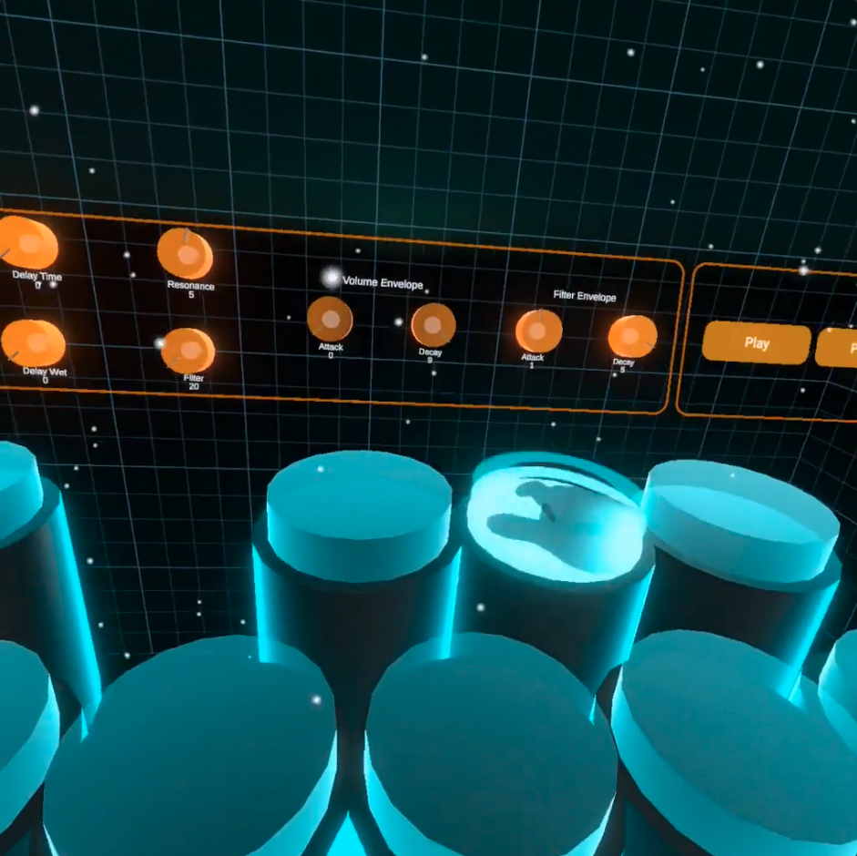

# VR Synth

A project exploring the idea of natural music creation in XR through the use of hand tracking and physics-based interactions. It dives into both interaction design and sound design that comes together in a fluid and organic way.

Built with the Unity Oculus Integration Toolkit on my Quest 2.

